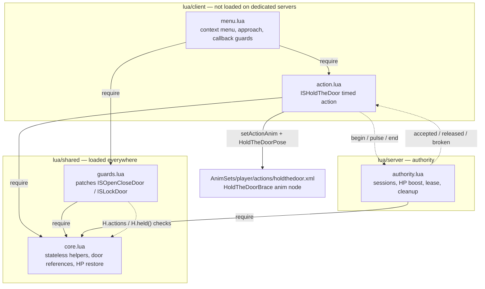
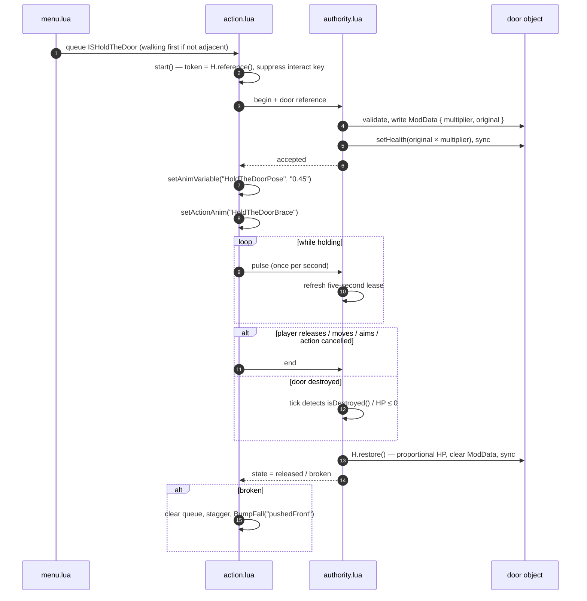
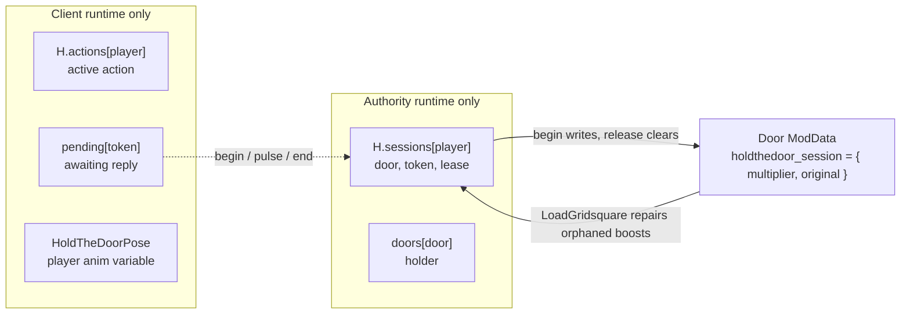

# Hold The Door

> No Barricade? No Problem!

Right-click a closed, unlocked, unbarricaded door and select **Hold It**. Your character approaches the door on their current side and keeps their arms extended in a braced pose. Select **Let Go**, move, run, aim, or use the normal cancel-action control to release it.

The holder cannot open or lock doors while bracing: the interaction key is suppressed, context callbacks are guarded, and vanilla open/lock timed actions are checked again at completion. The previous interaction-key setting is restored on exit.

Ordinary `IsoDoor` doors and player-built `IsoThumpable` doors are supported. Garage doors and multi-panel double doors are excluded because their panels move and break together. Locked doors (including key, padlock and combination locks), open doors and barricaded doors are ineligible. Barricades on either face count.

## Door health

**Door HP Multiplier** can be set in Sandbox Options. It multiplies remaining HP, not maximum HP: `IsoDoor` has no public maximum-health setter.

For example, multiplier of 3 makes a 500 HP door become 1500 while held. If it takes 600 damage, releasing converts the remaining 900 back to 300 HP. Releasing never repairs a door. Integer rounding rounds down, with a minimum of 1 HP for a surviving door. A broken door is never restored or resurrected.

The animation is a separate `HoldTheDoorBrace` action node sampling the vanilla `Bob_AimShove` clip at 45% of its duration, before the recoil. `m_TrackTimeToVariable` binds the clip position to the action-owned `HoldTheDoorPose` variable. The clip does not loop or advance; the engine blends into the pose over 0.25 seconds and out over 0.15 seconds. The timed action remains indefinite. There are no combat collision events, so bracing does not attack the door or shove nearby characters. The pose variable is registered before entering the animation state so B42 can include it in the remote action snapshot, and is cleared on release or disconnect.

Facing follows the door edge and the player's adjacent square: north-edge doors face N from their own square or S from the opposite square; west-edge doors face W or E respectively. `faceDirection()` keeps the body perpendicular even when the player stands off-center. This avoids `faceLocation()`'s implicit half-tile offset.

## Languages and mod metadata

English (`EN`) and Simplified Chinese (`CN`) are included. PZ selects the language automatically; no custom language setting is needed.

Files are under `42/media/lua/shared/Translate/<language>/` 

To add a language, copy the three English JSON files into the game's language-code directory and translate the values while preserving the keys. Save as UTF-8. Gameplay code continues to call `getText("ContextMenu_HoldTheDoor_HoldIt")`; it does not branch on language. English provides the fallback. Preserve the engine's `Translate`, language-code and JSON filename casing.

`mod.info` retains the ID `holdTheDoor`, supplies the English fallback description, and declares author, poster, category, version and Build 42 tag. Release 0.1.1 replaces mixed heading/font styles with plain paragraphs separated only by the supported `<BR>` command. `EN/Mod.json` mirrors that description; `CN/Mod.json` supplies the translated title and description. Mod metadata translations are handled by `Translator.readModTranslation`, independently of context-menu strings.

## State and networking

The client action progresses through **waiting for approval → holding → finished**. Cancellation is valid while waiting as well as while holding. Each attempt gets its own token so late responses cannot restart a cancelled animation or release a newer session.

Singleplayer and the multiplayer server share the same authority code. Only the authority changes door HP. A claim is validated against the actual door object, sprite, orientation, closed/lock/barricade state, player condition and the two squares touching its edge. One player can hold one door, and one door can have one holder. Clients send only plain data and the server uses the command sender as the player identity.

The client sends a heartbeat once per second; a five-second lease bounds cleanup after disconnects or a stalled client. Movement, aiming, death, invalid position, removal, locking, opening or barricading release the hold. Direct external door changes are detected and cancel the hold rather than being reverted. This is not a universal Java-level door lock against other players or other mods.

Door destruction is detected from `isDestroyed()`/zero health both during object removal and on the authority tick. The server tells the holder to stop their action and enter the native `wasBumped` fall transition (`stagger`, `BumpFall`, `pushedFront`). Ordinary administrative removal releases without falling. The game controls recovery and the normal consequences of falling; there is no forced movement-unlock timer. The scaffold's unused Stumble Duration option was removed for this reason.

Cleanup is idempotent. Runtime references stay in Lua tables, not serialized player ModData. Door ModData stores only the original HP and multiplier, which allows `LoadGridsquare` to repair orphaned boosts after loading. `OnSave` releases active holds before world objects are saved. Client queue/disconnect watchdogs restore input flags when an action disappears unexpectedly.

## Implementation

All paths below are relative to `Contents/mods/HoldTheDoor/42/media/`:

| File | Responsibility |
|---|---|
| `lua/shared/holdthedoor/core.lua` | Door eligibility, position, reference validation, health restoration |
| `lua/shared/holdthedoor/guards.lua` | Vanilla open/lock timed-action guards on client and server |
| `lua/server/holdthedoor/authority.lua` | Claims, HP changes, leases, destruction and persistence cleanup |
| `lua/client/holdthedoor/action.lua` | Timed action, replies, input flags, fall transition |
| `lua/client/holdthedoor/menu.lua` | Context options, approach path and callback guards |
| `AnimSets/player/actions/holdthedoor.xml` | Fixed bracing pose with entry/exit blending |

### Dependencies

`core.lua` is the dependency root; every other Lua module loads it. `menu.lua` is the client entry point and pulls in both `action.lua` and `guards.lua`. `guards.lua` reads `H.actions`/`H.sessions` to block vanilla open/lock actions while a hold is active. `authority.lua` returns early wherever `isClient()` is true, so only singleplayer or the server side owns authority.



### Runtime flow

In singleplayer `sendClientCommand`/`sendServerCommand` are replaced by direct calls to `H.command`/`H.onReply`, so the same sequence runs without packets.



### State ownership

Only door ModData survives a save; the Lua tables and the pose variable are runtime state that is rebuilt on load.



## Verification

References checked: pinned Umbrella **42.20.0**, locally available Java reference **42.20.4**, and vanilla Lua action implementations. The existing `versionMin=42.17` is retained, but older builds were not separately verified.

Run from the repository root with a working Lua interpreter:

```sh
lua HoldTheDoor/tests/lifecycle.lua
python3 HoldTheDoor/tests/validate.py
```

The lifecycle harness runs the actual mod modules with strict API doubles, covering eligibility, damaged-door scaling, repeat cancellation, ownership races, stale packets, movement/death, destruction versus removal, save/load repair, lease expiry, action guards, input restoration, all four facing directions and pose setup/cleanup. Static validation checks Lua API names against Umbrella, English/Chinese key parity, metadata consistency, held-pose XML and require-path casing.

These checks do not simulate Java animation playback, pathfinding, packet ordering inside the engine or the native fall state machine. Visual alignment and multiplayer behavior still need an eventual in-game smoke test.

Reference links: [vanilla base timed action](https://github.com/Project-Zomboid-Community-Modding/ProjectZomboid-Vanilla-Lua/blob/main/shared/TimedActions/ISBaseTimedAction.lua), [vanilla open-door action](https://github.com/Project-Zomboid-Community-Modding/ProjectZomboid-Vanilla-Lua/blob/main/shared/TimedActions/ISOpenCloseDoor.lua), [game shove clip mirrored source](https://github.com/Niteghxst/Project-Zomboid-Media-Files/blob/main/media/anims_X/Bob/Bob_AimShove.X), [official door API](https://projectzomboid.com/modding/zombie/iso/objects/IsoDoor.html).
