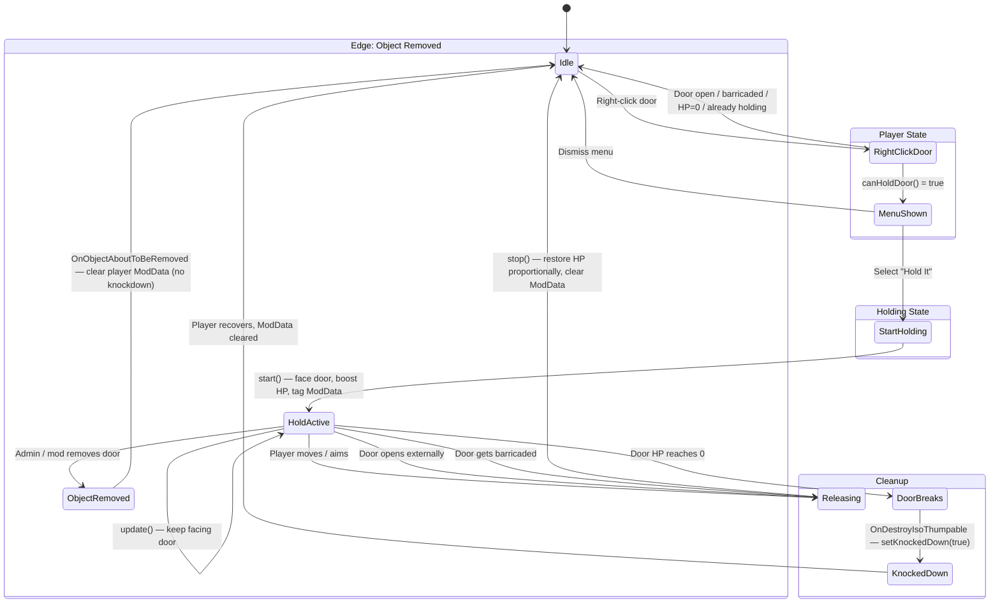
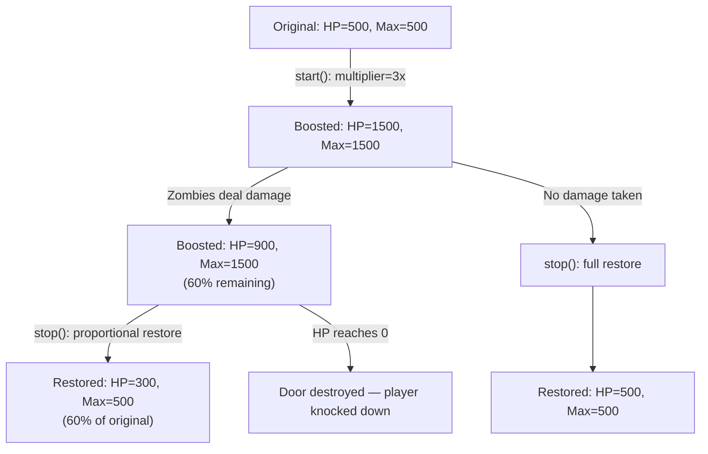

# Hold The Door

> No Barricade? No Problem!

Keep zombies out by holding the door — with your body. The door still breaks, but with your strength, it can hold longer. Your teammates will thank you for your bravery.

**Build 42** · **v0.1.0** · by kolulu

## Features

- **"Hold It"** context menu option on right-clicking any closed door
- Player enters a holding posture, physically bracing the door
- Door HP is **multiplied** while held (configurable in Sandbox Options)
- Moving, aiming, or running **automatically releases** the door
- If the door **breaks while held**, the player gets **knocked down**
- Zombies and NPCs can still attack the door — but it **cannot be opened by key** while held
- Works on **locked doors** (not on barricaded doors)
- All values configurable via **Sandbox Options**

## State Flow



## HP Modification Flow



## Sandbox Options

| Option | Type | Range | Default | Description |
|--------|------|-------|---------|-------------|
| HP Multiplier | double | 1.5 – 10.0 | 3.0 | How much the door's max HP is multiplied while held |
| Stumble Duration | double | 0.5 – 5.0 | 2.0 | How long the player is knocked down when the door breaks |

Access in Lua: `SandboxVars.HoldTheDoor.HPMultiplier`, `SandboxVars.HoldTheDoor.StumbleDuration`

## File Structure

```
HoldTheDoor/Contents/mods/HoldTheDoor/
├── common/                           # Required for B42 mod detection
└── 42/
    ├── mod.info
    ├── poster.png
    └── media/
        ├── sandbox-options.txt
        └── lua/
            ├── client/HoldTheDoor/
            │   ├── HoldTheDoorAction.lua   # Looped timed action
            │   └── HoldTheDoorMenu.lua     # Context menu hook
            ├── server/HoldTheDoor/
            │   └── HoldTheDoorServer.lua   # Destruction events, cleanup
            └── shared/
                ├── HoldTheDoor/
                │   └── HoldTheDoorShared.lua  # Constants, utilities
                └── Translate/EN/
                    ├── ContextMenu_EN.lua
                    └── Sandbox_EN.lua
```

## Architecture

| File | Location | Responsibility |
|------|----------|---------------|
| **HoldTheDoorShared** | `shared/` | ModData key constants, door validation, eligibility checks, HP restore utility |
| **HoldTheDoorAction** | `client/` | `ISBaseTimedAction` derivative — manages hold lifecycle (`start`/`update`/`stop`) |
| **HoldTheDoorMenu** | `client/` | `OnFillWorldObjectContextMenu` hook — adds "Hold It", disables vanilla Open/Unlock when held |
| **HoldTheDoorServer** | `server/` | Event hooks for door destruction (knockdown), save/load cleanup, MP disconnect cleanup |

## Safeguards

### Save/Load Recovery
- **OnGameStart**: Clears all players' `holdTheDoor_heldDoor` flags (no timed action survives a save/load)
- **OnLoadGridsquare**: When any grid square loads, scans objects for orphaned `holdTheDoor_isHeld` ModData and restores original HP proportionally. This is lazy — only runs once per square load, not per tick.

### Multiplayer
- **OnPlayerDisconnect**: Clears the disconnected player's holding flag. The door's orphaned ModData is cleaned on next chunk load via `OnLoadGridsquare`.

### Race Conditions
- **Idempotent cleanup**: `restoreDoor()` in the timed action uses a `_restored` guard flag — safe against double-call from `stop()` + `OnDestroyIsoThumpable` firing in the same tick.
- **One holder per door**: `canHoldDoor()` rejects if `isDoorHeld()` is already true.

### Runtime Validation (`isValid()`)
The timed action continuously checks and auto-cancels if:
- Door object becomes nil or loses its grid square
- Door is opened externally
- Door HP drops to 0
- Door gets barricaded while held

## Edge Cases

| Scenario | Behavior |
|----------|----------|
| Half-broken door (e.g. 50% HP) | Allowed — HP boost applies proportionally, restore also proportional |
| Door opened by another mechanism while held | `isValid()` detects `IsOpen()=true`, action cancels, HP restored |
| Player dies while holding | Timed action auto-stops, `stop()` runs cleanup |
| Admin removes door | `OnObjectAboutToBeRemoved` clears player state, no knockdown |
| Game saved mid-hold | `OnGameStart` + `OnLoadGridsquare` restore everything on next load |
| Player disconnects (MP) | `OnPlayerDisconnect` clears player flag, door cleaned on chunk load |
| Two players try to hold same door | Second player sees greyed-out "Hold It" with "Door is being held" tooltip |

## Future Plans

- Custom pushing/bracing animation
- Window holding support (extensibility built into `HoldTheDoorShared`)
- Multi-holder support (multiple players bracing one door)
- MP networking layer (`sendClientCommand`/`sendServerCommand` for door HP sync)
- Stamina drain while holding
